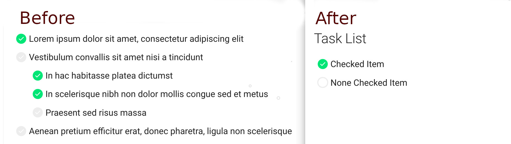

# mkdocs Styling

An Example for mkdocs CSS Styling

## Task list styling

This is an example of the `mkdocs` task list checkbox styling. The original `mkdocs` task list stying for an unchecked checkbox has a greyed out check. The new styling uses an empty checkbox.



## Run Server
```bash
mkdocs serve
```
