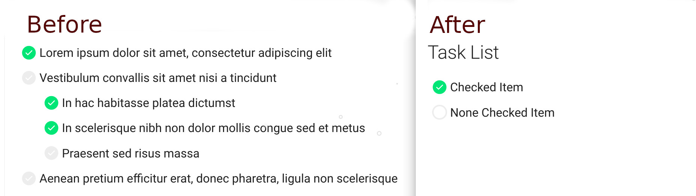

# mkdocs Styling

An Example for mkdocs CSS Styling

## Task list styling

This is an example of the `mkdocs` task list checkbox styling. The original `mkdocs` task list stying for an unchecked checkbox has a greyed out check. The new styling uses an empty checkbox.



## Requirements

- Python3
- Pip3

## Setup

Install mkdocs:
```bash
pip3 install mkdocs
```

Install Material theme for mkdocs:
```bash
pip3 install mkdocs-material
```

## Run Server
```bash
mkdocs serve
```
